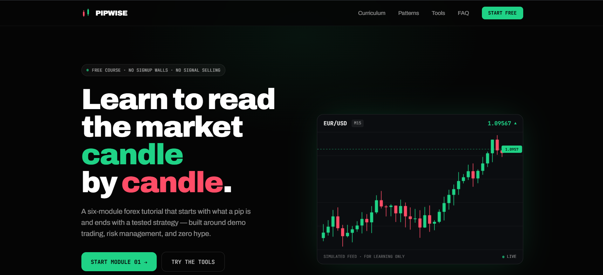

# PIPWISE — Forex Trading Tutorial

Dark, terminal-styled forex education landing page.

**Stack:** Next.js 14 (App Router) · TypeScript · Tailwind CSS



## Structure

```
app/
  layout.tsx              # fonts, metadata
  page.tsx                # landing page (client component)
  globals.css             # Tailwind + reveal/keyframe animations
  modules/[slug]/page.tsx # lesson pages (SSG, one per module)
lib/
  modules.ts              # curriculum data — edit lessons here
tailwind.config.ts        # bull/bear/amber tokens, tape/fadeUp animations
```

## Features

- Self-drawing live candlestick hero chart (simulated feed)
- Infinite ticker tape marquee (8 pairs incl. USD/PHP)
- Real-time session clock (Sydney/Tokyo/London/NY, UTC-based)
- Hover-animated candlestick pattern cards
- Working pip value calculator
- Scroll reveals, FAQ accordion, mobile nav, prefers-reduced-motion support

## Fonts note

Fonts load via `<link>` tags in `app/layout.tsx` (works everywhere, including offline builds). If you prefer `next/font/google` optimization on Vercel, swap the link tags for `Archivo` / `JetBrains_Mono` imports and set `--font-archivo` / `--font-jetbrains` variables back in `tailwind.config.ts`.
